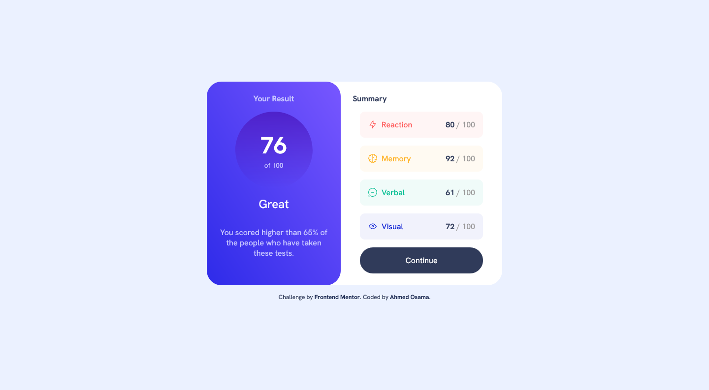

# Frontend Mentor - Results summary component solution

This is a solution to the [Results summary component challenge on Frontend Mentor](https://www.frontendmentor.io/challenges/results-summary-component-CE_K6s0maV). Frontend Mentor challenges help you improve your coding skills by building realistic projects.

## Table of contents

- [Overview](#overview)
  - [The challenge](#the-challenge)
  - [Screenshot](#screenshot)
  - [Links](#links)
- [My process](#my-process)
  - [Built with](#built-with)
  - [What I learned](#what-i-learned)
  - [Useful resources](#useful-resources)
- [Author](#author)

## Overview

### The challenge

Users should be able to:

- View the optimal layout for the interface depending on their device's screen size
- See hover and focus states for all interactive elements on the page
- **Bonus**: Use the local JSON data to dynamically populate the content

### Screenshot



### Links

- Solution URL: [Solution URL](https://your-solution-url.com)
- Live Site URL: [Live site URL](https://your-live-site-url.com)

## My process

### Built with

- Semantic HTML5 markup
- CSS custom properties
- Flexbox
- Mobile-first workflow
- Vanilla JavaScript

### What I learned

```js
createSummary(element);
```

```js
startCount(scoreSpan, element.score);
```

```js
fetchScores();
```

### Useful resources

- [Elzero web school - Increase numbers](https://www.youtube.com/watch?v=PLsUdgLnzgQ&list=PLDoPjvoNmBAycCXz5d9WvqlmykUIys5e8&index=14) - This helped me for remembering how make number increase into specific end. I really liked this pattern and will use it going forward.
- [Elzero web school - fetch API](https://www.youtube.com/watch?v=wZ90BnBbRsg&list=PLDoPjvoNmBAycCXz5d9WvqlmykUIys5e8&index=4&pp=iAQB) - his helped me for remembering how fetch data.json or any API. I'd recommend it to anyone still learning this concept.


## Author

- Frontend Mentor - [@Ahmed-Osama99](https://www.frontendmentor.io/profile/Ahmed-Osama99)
- Codepen - [@ahmed-osama99](https://codepen.io/ahmed-osama99)